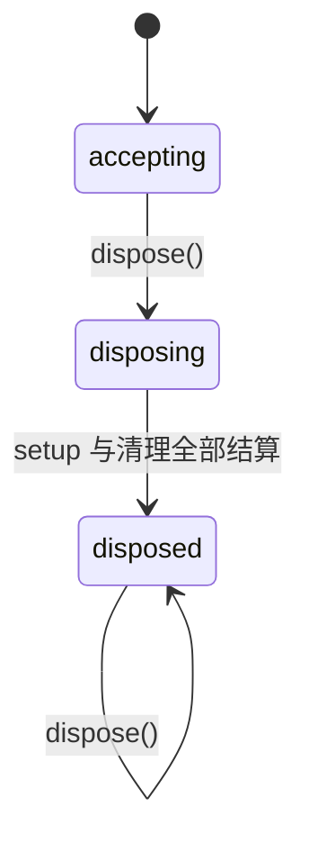
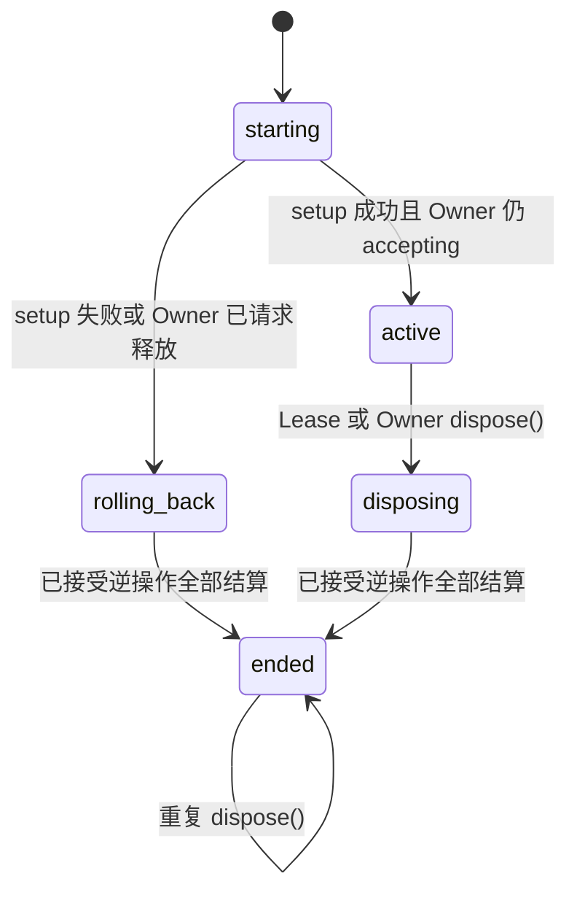

# Step 1：Revertible Effect 生命周期内核计划

| 字段 | 值 |
|---|---|
| 状态 | `planned` |
| 开发分支 | `step1` |
| 接受基线 | `step0` 的 `ce54eb276093b03556487ca6b0679df602b87e66` |
| 目标范围 | Effect 获取、逆操作所有权、LIFO 恢复、异步收敛、失败回滚和幂等释放 |
| 理论参考 | *A Programming Paradigm for Spatiotemporal Composability*（arXiv:2608.25512） |
| 前置阶段 | [Step 0：独立工程与基础契约](step0.md) |
| 后续阶段 | Step 2：Reactive Coeffect 与依赖有序生命周期 |

## 阶段结果

Step 1 要实现一个不依赖 Component、Service、LLM 或 Agent 的生命周期内核。调用方可以在一个 `EffectOwner` 中启动独立 Effect，通过局部配对的正向操作与逆操作获取资源；启动失败、单项释放或整个 Owner 关闭时，Runtime 都能等待已开始的异步操作收敛，并对已经接受的逆操作执行严格、串行的 LIFO 恢复。

本阶段的原子性表示：Effect 只有“完成启动并返回可管理 Lease”或“回滚全部已接受逆操作并报告失败”两种正常结果。如果逆操作自身失败，Runtime 会尝试其余逆操作并明确报告恢复不完整；它不会声称已经恢复到原状态。

完成 Step 1 后，项目应能独立回答以下问题：

1. 一项资源或内部状态变换由谁释放？
2. 多项操作交错完成时，逆操作按什么顺序执行？
3. 初始化进行中收到释放请求时，何时可以认为系统已经静止？
4. 初始化或清理失败时，哪些逆操作已执行，失败如何送达调用方？
5. 重复或并发释放是否会重复执行逆操作？

## 学习重点

Step 1 不是通用插件系统的缩小版。它只研究 Temporal Composability 在 TypeScript Runtime 中需要哪些可执行机制：

- 将一次可恢复操作与其逆操作放在同一调用位置；
- 在正向操作成功后、把结果交还调用方前记录逆操作；
- 根据逆操作的实际接受顺序恢复，而不是根据异步任务的创建顺序猜测；
- 把“请求释放”和“完成释放”区分开，并让释放等待系统静止；
- 让局部失败只回滚对应 Effect，不破坏同一 Owner 中的兄弟 Effect；
- 对不可恢复的外部输出保持明确边界。

论文提供组合性质及其成立条件。本阶段通过类型、状态机和测试验证工程不变量，不把测试结果描述成形式化证明。

## 设计约束

以下约束来自 [设计原则](design-principles.md)，是本阶段实现必须满足的行为。

### 所有权

- 每个被 Runtime 接受的逆操作只属于一个 Effect。
- 每个 Effect 只属于一个 `EffectOwner`。
- Effect 可以单独释放；Owner 释放所有仍存活的 Effect。
- 逆操作一旦开始便视为已消费，无论它成功还是失败，Runtime 都不自动重试。
- 一个子 Owner 可以作为普通资源由父 Effect 持有，因此本阶段不需要专用父子树 API。

### 顺序

- 每个正向操作成功后，Runtime 把逆操作同步追加到 Effect 的局部栈和 Owner 的全局栈。
- 单个 Effect 回滚或释放时，只选择该 Effect 的逆操作，并反向遍历局部栈。
- Owner 释放时，选择所有仍存活的逆操作，并反向遍历全局栈。
- 清理默认串行执行。Step 1 不根据标签、对象身份或推测的独立性并行重排。

栈中的追加位置表示逆操作的实际接受顺序，不需要另设数字序号或在释放时排序。例如 Effect A 先启动但较晚获得资源，Effect B 后启动却先获得资源，实际接受顺序是 `B → A`，Owner 的恢复顺序必须是 `A → B`。

### 异步 Inertia

- `dispose()` 立即阻止新的 Effect 和新的正向操作开始，并通知相关 `AbortSignal`。
- 已经调用的正向操作可以结算。若它成功，Runtime 必须先接受对应逆操作，随后才能清理。
- Runtime 等待仍在启动的 Effect 结算，再完成 Owner 释放。
- Abort 是协作通知，不是抢占。忽略 Abort 且永不结算的用户代码会使释放一直等待。
- Core 不使用超时伪造静止状态。超时和强制终止属于将来的 Host 策略。

### 失败

- 正向操作失败时，没有可用返回值，因此 Runtime 不执行该操作的逆操作。
- Effect 启动失败时，Runtime 回滚该 Effect 已经接受的逆操作，不回滚兄弟 Effect。
- 一个逆操作失败不能阻止剩余逆操作执行。
- `dispose()` 只有在所有目标逆操作均已结算后才完成或拒绝。
- Owner 和 Lease 在清理失败后仍进入终态，避免对可能已部分执行的逆操作进行隐式重试。

### 外部输出边界

`apply()` 只接受 Runtime 能通过逆操作恢复的资源获取或内部状态变换。发送消息、支付、向外部系统提交任务或已经被外部观察的写入不因提供一个回调就变成可恢复 Effect。此类 Emission 需要幂等键、延迟提交或业务补偿，留到工作流与持久化阶段设计。

## 计划公开 API

本节定义 Step 1 的实现目标。实现若发现语义矛盾，应先更新本计划，再修改公开导出。

```ts
export type Awaitable<T> = T | PromiseLike<T>

export type EffectOperation<T> = () => Awaitable<T>

export type EffectReverter<T> = (value: T) => Awaitable<void>

export type EffectOwnerStatus = 'accepting' | 'disposing' | 'disposed'

export interface EffectContext {
  readonly signal: AbortSignal

  apply<T>(
    label: string,
    operation: EffectOperation<T>,
    revert: EffectReverter<T>,
  ): Promise<T>
}

export interface EffectLease<T> {
  readonly label: string
  readonly value: T
  dispose(): Promise<void>
}

export class EffectOwner {
  readonly status: EffectOwnerStatus

  run<T>(
    label: string,
    setup: (context: EffectContext) => Awaitable<T>,
  ): Promise<EffectLease<T>>

  dispose(): Promise<void>
}
```

典型用法如下：

```ts
const owner = new EffectOwner()

const server = await owner.run('research-server', async effect => {
  const listener = await effect.apply(
    'listen',
    () => startServer(),
    activeListener => activeListener.close(),
  )

  return listener
})

await server.dispose()
await owner.dispose()
```

### API 选择

| 选择 | 原因 |
|---|---|
| `EffectOwner` | 直接表达生命周期所有权，不提前引入 Step 2 的 Component 或 Step 3 的 Scope |
| `run()` | 把一组获取操作组成一个可独立释放的 Effect，并为失败回滚建立明确范围 |
| `EffectContext.apply()` | 调用方在正向操作旁提供逆操作；Runtime 在结果返回前完成登记 |
| `EffectLease<T>` | 同时返回启动结果和该 Effect 的释放能力，不把裸函数伪装成完整生命周期状态 |
| `AbortSignal` | 释放请求可以通知仍在等待的用户代码，同时保持协作取消和异步 Inertia |
| 必填标签 | 错误能指出失败的 Effect 和逆操作；标签只用于诊断，不作为稳定身份 |
| 全部异步释放 | 同一 API 覆盖同步与异步逆操作，调用方必须显式等待静止 |

第一版不公开 Effect Iterator。`apply()` 已能逐项建立获取与逆操作的关系，且比同步与异步 Generator 联合类型更容易约束返回值、异常和取消。后续真实用例若需要流式 Effect，可以在不改变底层接受顺序和清理记录的前提下增加适配层。

Step 1 完成前，以上 API 仍是待实现设计。测试若暴露语义矛盾，可以同步修改接口与计划；Step 2 应复用最终验证过的所有权行为，不据此提前冻结尚未发布的函数签名。

## 状态模型

### Owner 状态



- `accepting`：允许 `run()` 和已经启动的 Effect 调用 `apply()`。
- `disposing`：拒绝新工作，发送 Abort，等待已开始工作结算并清理。
- `disposed`：终态；即使清理曾失败也不重新开放。

### Effect 内部状态



Effect 内部状态服务于实现和状态机测试，不在 Step 1 暴露为公共枚举。公开调用方只依赖 `run()` 是否成功、`dispose()` 是否结算以及 Owner 的三态状态。

## 操作语义

### `EffectOwner.run()`

1. `run()` 在执行用户 `setup` 前登记 Effect 记录，使重入的 Owner 释放能够看到正在启动的 Effect。
2. `setup` 可以进行普通计算，并通过同一个 `EffectContext` 执行零个或多个 `apply()`。
3. `setup` 成功且 Owner 仍为 `accepting` 时，`run()` 返回活动 Lease。
4. `setup` 抛出或拒绝时，Runtime 关闭该 Effect 的接纳入口并回滚其已接受逆操作。
5. Owner 在启动期间进入 `disposing` 时，Runtime 允许已开始操作结算，随后清理该 Effect；`run()` 不返回一个已经失去所有权的活动 Lease。

同一 Owner 允许多个 `run()` 并发启动。Runtime 不按调用顺序串行化整个 `setup`，因为一个长期初始化不应阻塞无关 Effect。全局逆操作栈根据每个 `apply()` 的实际完成与接受顺序确定。

### `EffectContext.apply()`

1. Runtime 先确认 Owner 与当前 Effect 仍接受新操作。
2. Runtime 在调用 `operation` 前把它标记为已开始。
3. `operation` 成功后，Runtime 在同一个同步延续中把 Cleanup record 追加到局部栈和全局栈，然后才把 `value` 返回给 `setup`；登记过程不包含 `await`、用户回调或其他可重入调用。
4. 释放请求若在 `operation` 等待期间到达，Runtime 等待该操作结算。成功结果仍先登记逆操作，再进入清理。
5. `operation` 失败时，Runtime 原样保留失败原因，不调用没有获得值的 `revert`。

`operation` 必须在成功返回前自行处理内部的部分获取。如果一次操作可能依次获得多个资源，它应拆成多个 `apply()`；Runtime 无法恢复一个在抛错前从未交还给它的资源。

Step 1 的可变状态只存在于一个 JavaScript Realm。Promise continuation 在两次异步让出之间顺序执行，因此双栈追加和 Owner 状态转换可以形成同步临界区，不需要 `Atomics` 或锁。Owner 不可跨 Worker 共享；跨线程所有权属于后续 Host 协议。

### `EffectLease.dispose()`

- 第一次调用关闭该 Effect 的接纳入口、发送 Abort，并启动或加入该 Effect 的清理任务。
- 除当前清理调用链中的非法重入外，并发与重复调用返回同一个清理 Promise，不重复执行逆操作。
- 该 Promise 在此 Effect 的全部已开始操作和逆操作结算后完成或拒绝。
- Lease 清理只处理自己的逆操作，不影响兄弟 Effect。
- Lease 清理完成后，Owner 不再把它计入后续释放。

### `EffectOwner.dispose()`

- 第一次调用同步把状态改为 `disposing`，拒绝新的 `run()` 和 `apply()`，并向所有 Effect 发送 Abort。
- Runtime 等待已经开始的正向操作和 `setup` 结算，然后反向遍历全局清理栈并处理所有剩余记录。
- 除当前清理调用链中的非法重入外，并发与重复调用返回同一个 Promise。
- 所有目标记录结算后，Owner 进入 `disposed`。存在清理错误时 Promise 拒绝，但状态仍为 `disposed`。
- 一个逆操作可以等待另一个 Owner 或 Lease 的释放。逆操作不得等待当前正在执行它的同一个释放任务；Runtime 使用异步调用上下文识别同任务重入和沿当前调用链形成的释放环，并报告明确错误。

## 竞争条件决策表

| 场景 | 计划行为 |
|---|---|
| `operation` 等待时 Owner 释放 | 发送 Abort，等待操作；成功则登记并立即执行逆操作，失败则完成该操作的失败路径 |
| `setup` 等待时 Owner 释放 | 发送 Abort并等待 setup；不再允许新的 `apply()`，setup 结算后清理已接受记录 |
| Lease 与 Owner 同时释放 | 两者加入同一批单次清理记录；每个逆操作最多执行一次 |
| 两个 Effect 的操作交错成功 | 按全局栈中的实际接受顺序形成 LIFO，不按 Effect 创建顺序重排 |
| `setup` 失败且回滚成功 | `run()` 保留原始 setup 失败 |
| `setup` 失败且回滚也失败 | `run()` 报告组合错误，同时保留 setup 原因和全部回滚失败 |
| 一个逆操作失败 | 记录失败并继续执行其余目标逆操作 |
| 释放完成后再次 `run()` | 在调用 setup 前拒绝，不产生用户副作用 |
| 释放完成后重复 `dispose()` | 返回第一次释放的已结算 Promise，不执行新工作 |

## 错误模型

Step 1 使用 `HarnessError` 派生错误，并保留原始异常对象供程序检查。错误码至少覆盖：

| 错误码 | 触发条件 | 必须保留的信息 |
|---|---|---|
| `EFFECT_OWNER_INACTIVE` | Owner 已开始或完成释放后请求新工作 | Effect 或操作标签、Owner 状态 |
| `EFFECT_START_INTERRUPTED` | setup 成功前 Owner 已请求释放 | Effect 标签 |
| `EFFECT_ROLLBACK_FAILED` | setup 失败后的一个或多个逆操作失败 | 原始 setup 原因、按执行顺序排列的清理失败 |
| `EFFECT_DISPOSAL_FAILED` | Lease 或 Owner 释放时一个或多个逆操作失败 | 释放目标、按执行顺序排列的清理失败 |
| `EFFECT_REENTRANT_DISPOSE` | 逆操作直接等待或调用正在执行它的同一释放任务 | Effect 与逆操作标签 |

如果 setup 失败而回滚全部成功，`run()` 直接拒绝原始失败，不增加包装层。组合错误保存原始 `unknown` 原因和清理失败数组；其 JSON 诊断只投影稳定、安全的标签、数量与消息，不把任意对象直接放入 `details`。

清理错误的顺序等于逆操作的实际执行顺序。Runtime 不只保留第一个错误，因为这会隐藏其他未恢复资源。

错误消息必须包含失败的 Owner、Effect 或操作标签、发生阶段、相关状态与失败数量。消息不承载内部数组、任务标识或控制流细节；调用方通过错误类型、错误码和结构化属性取得完整诊断。

## 内部数据模型

计划实现使用三个内部记录：

| 记录 | 职责 |
|---|---|
| Owner record | Owner 状态、Effect 集合、按接受顺序追加的全局清理栈、共享释放任务 |
| Effect record | 标签、AbortController、setup 任务、是否仍接受操作、按接受顺序追加的局部清理栈、共享 Lease 释放任务 |
| Cleanup record | 操作标签、逆操作、单次执行状态和共享执行任务 |

Cleanup record 是防止 Lease 与 Owner 竞争时重复清理的最小单元。Runtime 在一个同步临界区内创建并保存共享执行 Promise，再让该 Promise 在后续微任务中调用用户逆操作。重入调用因此总能取得已发布的任务，不会遇到“已认领但任务仍为空”的中间状态。选择阶段认领记录，执行阶段按序等待并收集错误。

Owner 与 Lease 的每次释放各有一个内部任务标识。实现使用 Node `AsyncLocalStorage` 传播当前调用链上的释放标识；目标 `dispose()` 如果发现自己的标识已经在当前链中，便以 `EFFECT_REENTRANT_DISPOSE` 拒绝。该机制能覆盖直接自等待和当前调用链内的 `A → B → A`，不能证明两个独立启动的释放任务之间不存在更间接的互等环。

内部可变状态不从公共对象泄漏。测试通过可观察资源、Promise 结算和公开错误验证行为，不读取私有数组来证明实现正确。

## 目录计划

```text
Experimental/
├─ src/
│  ├─ effect/
│  │  ├─ index.ts
│  │  ├─ types.ts
│  │  ├─ errors.ts
│  │  └─ owner.ts
│  └─ index.ts
├─ tests/
│  ├─ effect/
│  │  ├─ owner.spec.ts
│  │  ├─ rollback.spec.ts
│  │  ├─ concurrency.spec.ts
│  │  ├─ errors.spec.ts
│  │  └─ model.spec.ts
│  └─ helpers/
│     └─ deferred.ts
└─ notes/
   └─ step1.md
```

文件按职责拆分，不创建只有重导出或占位内容的模块。实现过程中若某个计划文件没有形成独立职责，应合并到最近的所有者。

## 实施顺序

### 1.1 固定可观察行为

- 根据本计划写第一组失败测试，覆盖局部获取、LIFO、启动失败回滚和幂等释放。
- 定义 `EffectOperation`、`EffectReverter`、`EffectContext`、`EffectLease` 与 `EffectOwnerStatus`。
- 定义错误类型和稳定错误码，不导出内部状态枚举。

完成条件：测试可以表达调用方看到的顺序、结果与错误，而不依赖内部数组。

### 1.2 实现单次清理记录

- 实现 Cleanup record 的单次认领与共享 Promise。
- 在调用用户逆操作前发布共享 Promise，消除重入时 `executionTask` 尚未赋值的窗口。
- 同时支持同步抛错、异步拒绝和正常完成。
- 保证错误后不重试，并为上层聚合保留原始原因。
- 使用异步调用上下文检测同任务重入和当前调用链内的释放环。

完成条件：并发调用同一记录只执行一次逆操作，并且所有调用方观察到同一结算结果。

### 1.3 实现 Effect 启动与局部回滚

- 在调用 setup 前创建 Effect record 和 AbortController。
- 实现 `apply()` 的开始检查、异步等待、成功登记与结果交付顺序。
- setup 失败时关闭接纳入口并只回滚当前 Effect。
- setup 成功时返回 Lease；Owner 已进入释放阶段时改走中断清理路径。

完成条件：任何 `run()` 失败都不留下该 Effect 可观察的活动资源，除非错误明确报告逆操作失败。

### 1.4 实现 Lease 与 Owner 释放

- Lease 反向遍历自己的局部清理栈。
- Owner 等待全部启动任务和已开始操作后，反向遍历全局清理栈。
- Lease 与 Owner 竞争时共享 Cleanup record 的执行任务。
- 所有目标结算后再完成状态转换和 Promise。

完成条件：释放完成表示已达到静止状态，而不是只发送了 Abort 或启动了清理。

### 1.5 完成错误聚合与诊断

- 聚合全部清理失败，并保留 Effect 与操作标签。
- 区分启动中断、局部回滚失败和显式释放失败。
- JSON 投影只包含稳定、安全字段；原始异常保存在运行时属性中。
- 错误消息指出失败对象、阶段和调用方下一步可以检查的字段。

完成条件：单一失败、多个失败以及 setup 与 rollback 同时失败都能由调用方区分。

### 1.6 增加状态机与异步竞争测试

- 使用受控 Deferred Promise 制造确定性的交错，不依赖真实计时和随机调度。
- 使用模型测试生成操作序列，比较参考资源集合、接受顺序和实际清理轨迹。
- 如手写生成器不能清晰缩减失败案例，引入 `fast-check` 作为唯一新增开发依赖。
- 所有内部异步任务在创建处安装拒绝处理，并用调用方可观察结果验证异常送达；普通 Vitest 不安装进程级 `unhandledRejection` 监听器。

完成条件：测试覆盖本计划的竞争条件决策表，并能在错误实现中稳定失败。

### 1.7 更新公共入口和使用文档

- 从 `src/effect/index.ts` 和根 `src/index.ts` 导出已实现的公共 API。
- 更新根 README，给出一个实际执行过的最小生命周期示例。
- 更新本计划的最终 API、验收结果、实际依赖和执行证据。
- 更新 [设计原则](design-principles.md) 中已经由实现支持的项目要求；未验证内容继续保留为假设。

完成条件：源码、测试、README、设计原则和本计划对同一行为使用一致术语。

## 测试矩阵

### 基本行为

- 单个同步操作成功并由 Lease 释放。
- 单个异步操作成功并由 Owner 释放。
- 一个 Effect 的多个逆操作严格 LIFO。
- 多个 Effect 的交错操作按全局接受顺序 LIFO。
- setup 不含操作时仍能得到并释放 Lease。

### 回滚与隔离

- 第二个操作失败时只逆转第一个已接受操作。
- 一个 Effect 启动失败不释放兄弟 Effect。
- setup 失败且回滚成功时保留原始异常身份。
- setup 与一个或多个逆操作同时失败时报告组合错误。
- 逆操作失败后仍继续执行剩余逆操作。

### 幂等与竞争

- Lease 连续、并发和 Owner 竞争释放时，每个逆操作最多执行一次。
- Owner 多次释放返回同一个 Promise 实例。
- operation 等待期间释放会先等待结果，再恢复成功获取的资源。
- setup 等待期间释放会发送 Abort、拒绝后续 `apply()` 并等待 setup。
- 释放开始后新的 `run()` 不执行 setup。
- 直接自等待和当前调用链内的释放环不会静默挂起。
- Cleanup record 在调用用户逆操作前已经发布共享执行 Promise。

### 静止与失败完成

- 异步逆操作未完成前，`dispose()` 不结算。
- 所有逆操作失败时仍全部被调用。
- 失败释放后 Owner 与 Lease 均保持终态。
- 重复释放不会重试失败的逆操作。
- 测试结束时没有活动资源和未处理 rejection。

### 类型与构建产物

- `apply()` 的正向结果类型正确传给逆操作和调用方。
- Lease 的 `value` 保留 setup 返回类型。
- 非函数操作或逆操作由 TypeScript 拒绝。
- 根入口的源码 Smoke Test 和普通 Node 构建产物 Smoke Test 能访问 Step 1 公共导出。

### 模型性质

模型测试至少验证以下性质：

1. 每个已接受逆操作执行次数不超过一次。
2. 每个成功交付的活动资源最终对应一次清理尝试。
3. 一次清理批次中的执行轨迹等于对应接受栈的反向顺序。
4. 局部回滚不选择其他 Effect 的记录。
5. Owner 释放结算后不存在可开始的新操作。
6. 清理失败只改变结果，不改变后续记录仍会被尝试的事实。

属性输入可以生成 Effect 分组、操作结果、清理失败位置和异步完成排列。测试根据生成值显式结算 Deferred，并从实际接受轨迹计算期望恢复顺序；生成器不直接调用随机延迟或依赖事件循环碰巧形成某种交错。

## 验证命令

实现阶段按需运行聚焦测试，最终至少执行：

```text
pnpm install --frozen-lockfile
pnpm run lint
pnpm run typecheck
pnpm run test
pnpm run build
pnpm run test:built
pnpm run check
git diff --check
```

若新增 `fast-check`，先更新 `package.json` 和 Lockfile，再重新执行冻结安装。文档只记录实际执行过的命令，不把计划命令写成通过证据。

## 验收清单

### API 与所有权

- [ ] 根入口导出可用的 `EffectOwner`、`EffectContext` 和 `EffectLease` 类型。
- [ ] 每个逆操作有且只有一个 Effect 所有者。
- [ ] Lease 可以独立释放，Owner 可以释放全部剩余 Effect。
- [ ] 标签用于诊断但不充当持久 ID。

### 恢复行为

- [ ] 局部与全局清理均按实际接受栈的反向顺序执行严格 LIFO。
- [ ] 启动失败只回滚当前 Effect 已接受的逆操作。
- [ ] 逆操作失败不会阻止其余逆操作。
- [ ] 清理失败后不自动重试可能已部分执行的逆操作。

### 异步生命周期

- [ ] 释放阻止新工作并向在途 setup 发送 Abort。
- [ ] 已开始的正向操作结算后才进入对应清理。
- [ ] `dispose()` 等待目标启动与清理任务全部结算。
- [ ] 重复和并发释放共享同一 Promise，且不重复清理。
- [ ] 直接自等待和当前调用链内的释放环得到明确错误而不是挂起。
- [ ] 重入清理始终能观察到已经发布的共享执行 Promise。

### 错误与诊断

- [ ] 启动中断、回滚失败、显式释放失败和非活动 Owner 可以区分。
- [ ] 组合错误保留原始 setup 原因与全部清理失败。
- [ ] JSON 诊断不包含不可序列化值。
- [ ] 错误中的失败顺序与实际清理尝试顺序一致。

### 测试与独立性

- [ ] 基本、失败、竞争、状态机和类型测试全部通过。
- [ ] 普通 Node 可以从构建产物导入 Step 1 API。
- [ ] 源码与 Lockfile 不引入 DSH、Cordis 或父工作区依赖。
- [ ] `pnpm run check` 和 `git diff --check` 通过。
- [ ] 本页记录最终 API、偏离计划的原因和实际执行证据。

## 风险与验证点

| 风险 | 本阶段处理 |
|---|---|
| 异步完成顺序与创建顺序不同 | 以逆操作实际追加到全局栈的顺序为准，并用 Deferred 测试交错 |
| operation 成功后尚未登记便收到释放 | 在同一个无异步让出的同步临界区追加局部栈和全局栈，再返回结果 |
| Lease 与 Owner 重复清理 | Cleanup record 单次认领，并在调用用户代码前发布所有竞争者共享的任务 |
| setup 失败掩盖 rollback 失败 | 组合错误同时保存两类失败 |
| 清理遇到第一个错误便停止 | 串行尝试全部目标，再统一拒绝 |
| Abort 被误解为强制停止 | API 和测试明确 Abort 只发出协作通知，释放仍等待结算 |
| operation 抛错前已经产生部分副作用 | 要求拆分 `apply()` 或由 operation 自行恢复；Runtime 只管理已交还结果 |
| 清理等待自身或形成调用链内的环 | 用 `AsyncLocalStorage` 传播释放标识并报告稳定错误；独立启动任务之间的互等环保留为限制 |
| 错误聚合破坏 JSON 安全 | 原始异常与 JSON 诊断分离，诊断只保存稳定投影 |
| 过早构建 Component/Fiber | 公共层只包含 Owner、Context 和 Lease，依赖激活留到 Step 2 |

## Claude 审计后的修订

Claude 的审计作为设计输入处理，原始示例不直接作为实现规范。以下决策已经合入本计划：

| 审计意见 | 处理 | 计划变更 |
|---|---|---|
| operation 成功到逆操作登记之间可能出现窗口 | 采纳 | 双栈登记放在无 `await`、无用户回调的同步临界区，登记完成后才返回结果 |
| 并发 Effect 需要稳定的全局接受顺序 | 采纳问题，简化方案 | 使用 Owner 全局追加栈表达接受顺序，不增加数字序号、排序或跨线程同步 |
| `claimed` 与 `executionTask` 之间可能出现重入窗口 | 采纳并修正示例 | 先创建并保存延后调用用户代码的共享 Promise，再执行逆操作；禁止“先标记、后同步调用、最后赋值任务” |
| 直接或间接释放重入可能死锁 | 部分采纳 | `AsyncLocalStorage` 检测同一异步调用链中的自等待和环；独立任务之间形成的互等环不作完整证明 |
| Deferred 可以稳定制造异步交错 | 采纳 | 竞争测试显式控制 Promise 结算顺序，不使用真实延迟 |
| 随机延迟可以扩大模型测试覆盖 | 不采纳 | 属性输入可以生成完成顺序，但测试必须按输入主动释放 Deferred；不使用 `Math.random()` 或墙钟调度 |
| 所有可变状态应在同步片段内修改 | 采纳 | 每次状态转换和记录发布在异步让出前完成，异步步骤只等待已经公开的任务 |
| 一律使用 `async/await` 才能保证原子性 | 不采纳 | 原子性取决于异步让出位置和任务发布顺序；内部可用 Promise continuation 在调用逆操作前发布共享任务 |
| 冻结所有公共对象 | 不采纳 | 通过私有字段和只读投影保护内部状态，不限制调用方包装或扩展 Lease |
| 增加开发模式 `__debug`、内部计数器和性能标记 | 不采纳 | Step 1 没有诊断或性能需求，不增加环境相关的隐藏 API |
| 预分配数组、使用 32 位序号和 GC 回收测试 | 不采纳 | 没有测量证据，且全局栈不需要序号；GC 时机不适合作为确定性验收条件 |
| 提前保证 Step 2 中 API 签名不变 | 不采纳 | Step 1 公开 API 在实现完成前保持可修订，Step 2 复用已验证行为而不是未验证签名 |

审计后的关键改进是把“原子认领”细化为两个不同问题：逆操作必须先进入所有权栈再把正向结果交给用户；清理任务必须先对竞争者可见再调用可能重入的用户逆操作。两处都依靠 JavaScript 同一 Realm 内无异步让出的同步片段，而不是依靠注释中的“原子”字样。

## 明确不实现

- Service Key、Provider、Consumer、Coeffect 或依赖图。
- Component/Fiber 激活、停用、失败状态与热重载。
- Scope、事件、Middleware 或 Hook。
- LLM、Tool、Session、Agent、Subagent 或多 Agent 调度。
- Effect Iterator、Generator 专用语法或装饰器。
- 并行清理、交换性推断或 Observational Equivalence 判定器。
- 超时、强制取消、进程终止或 Host Shutdown 策略。
- 外部 Emission 的事务提交、幂等键或业务补偿。
- 持久化恢复、跨进程 Effect 所有权或分布式事务。
- 稳定 Effect ID、诊断树或遥测传输。

## 执行证据

本页当前只完成规划，尚未开始 Step 1 代码实现。验收项保持未勾选；实现阶段只记录实际执行的命令、测试数量、偏离计划的设计及其原因。

规划提交执行了 `pnpm run check`，Step 0 的 6 个测试文件和 24 项测试继续通过，Lint、类型检查、构建与普通 Node Smoke Test 通过；本地 Markdown 链接检查和 `git diff --check` 也通过。这些结果只证明规划变更没有破坏现有基线，不是 Step 1 行为的实现证据。

Claude 审计整合执行了 `pnpm run check`，同一组 6 个测试文件和 24 项测试继续通过；Markdown 围栏、相对链接和 `git diff --check` 通过。审计修订仍属于规划证据，不表示 Effect Runtime 已实现。

## 完成后的下一步

Step 2 在本生命周期内核之上实现 Reactive Coeffect：能力键、Provider 身份、Consumer 需求、依赖变化分类以及 Consumer 先于 Provider 的有序停用。Step 2 只组合 Step 1 已验证的所有权与释放行为，不在依赖图中另建一套清理机制。
